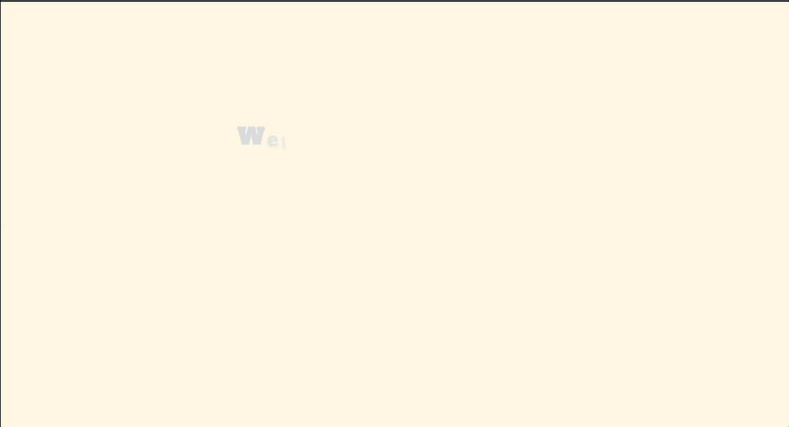
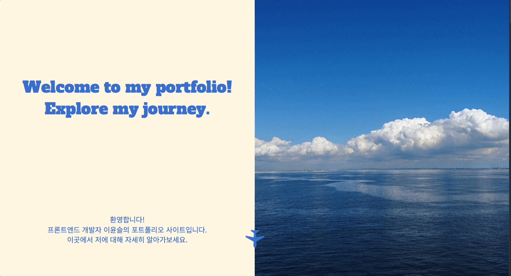

## ✈️ 포트폴리오 사이트

### [포트폴리오 보러가기 ✈️✈️ ](https://ysisys0202.github.io/yun-portfolio/)

## 📌 소개

 
FE 개발자로서의 여정을 소개하는 포트폴리오 사이트입니다.

## 🛠 사용된 기술

| **용도**       | **기술**                     |
| -------------- | ---------------------------- |
| **코어**       | HTML, SCSS, Javascript       |
| **애니메이션** | GSAP                         |
| **번들링**     | Vite                         |
| **배포**       | Github Pages, Github Actions |

## ✨ 구현 기능

### 💫 애니메이션

| Text 애니메이션                                                                                  | 스크롤 애니메이션                                                                                    |
| ------------------------------------------------------------------------------------------------ | ---------------------------------------------------------------------------------------------------- |
|  |  |

- Text 애니메이션 구현
- **GSAP**를 활용한 스크롤 기반의 애니메이션 구현
- **SVG Motion Path**를 사용한 비행기 애니메이션 구현
